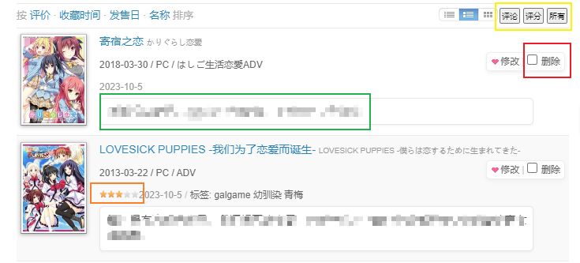
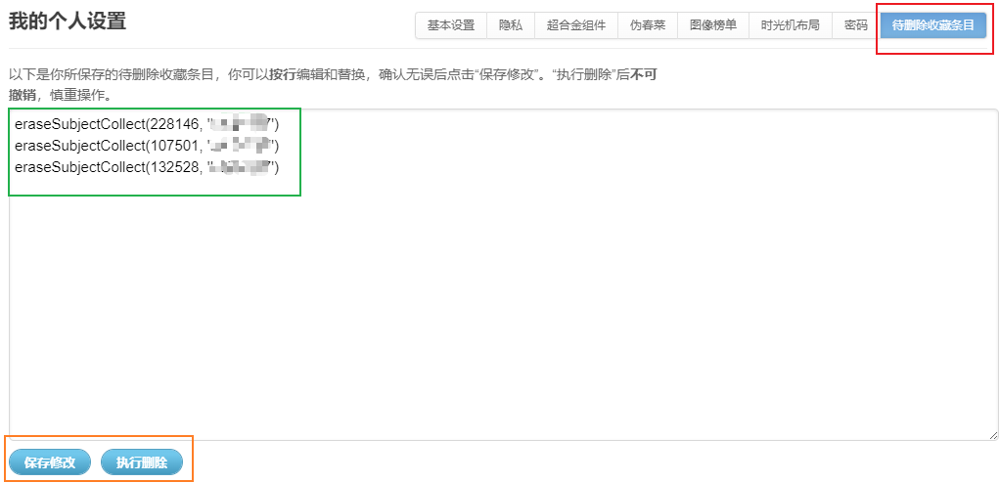

# collect-delete-batch脚本说明

批量标记收藏条目，自动执行删除操作，免去“删除确认”的弹窗烦恼。
列表页面进行标记，设置页面进行删除前确认，之后浏览器自动批量删除操作，删除期间需要保持浏览器。
每条删除操作预留5秒，避免给后台服务器造成不当影响（~~不会更高效的写法~~）。

**删除操作不可撤回，不要用于不当行为，谨慎使用！！！**

## 列表页面



在删除按钮前增加复选框，用于标记待删除的收藏条目（红色方框）；

增加三个快速选择条件（黄色方框），“评论”、“评分”和“所有”，
分别选择或反选本页全部收藏条目、本页没有评论条目（绿色方框）和本页没有打分的收藏条目（橙色方框）；
鼠标放在相应的按钮上，也会有相应的提示。

如果不小心标记错误，可以再次点击复选框取消标记；
所有标记的收藏条目的“删除指令”都将送到[设置页面](#列表页面)进行确认后，开始批量删除。

## 设置页面



例如在列表页面点击“评分”，条目`228146`会被放入待删除列表，而条目`49320`则不会进入待删除列表。
如果有错误标记的条目，则可以删除对应的指令行，再点击“保存修改”。
在确认无误后，点击“执行删除”按钮，浏览器将会逐条删除，每条删除时间大约预留5秒，
删除时只要不关闭浏览器即可，不妨碍进行其他工作。

## 杂项

也可以在设置页面自行填写删除指令，每行一个，
格式为`eraseSubjectCollect(subject, 'user')`，
只需将`subject`替换为相应的数字即可。
`user`则需要在删除时自行查看，这里给出一个不太优雅的命令提供参考，
在浏览器的控制台输入如下命令，即可看到如上格式的结果。

```js
document.querySelectorAll("#browserItemList .collectModify a")[1].attributes.onclick.value
```

需要注意的是，指令格式一定要**按行正确输入**，否则可能产生不可逆的损害。
因此，并不推荐在设置页面修改删除指令。

## 参考

设置页面格式参考[bangumi过滤搜索结果](https://github.com/bangumi/scripts/blob/master/liaune/bangumi_result_blacklist.user.js)。
