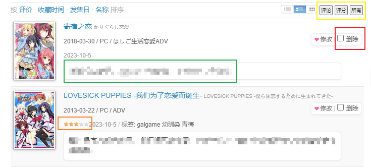
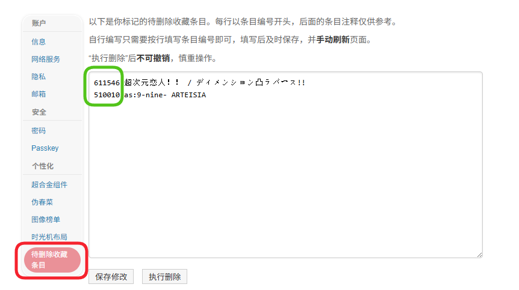
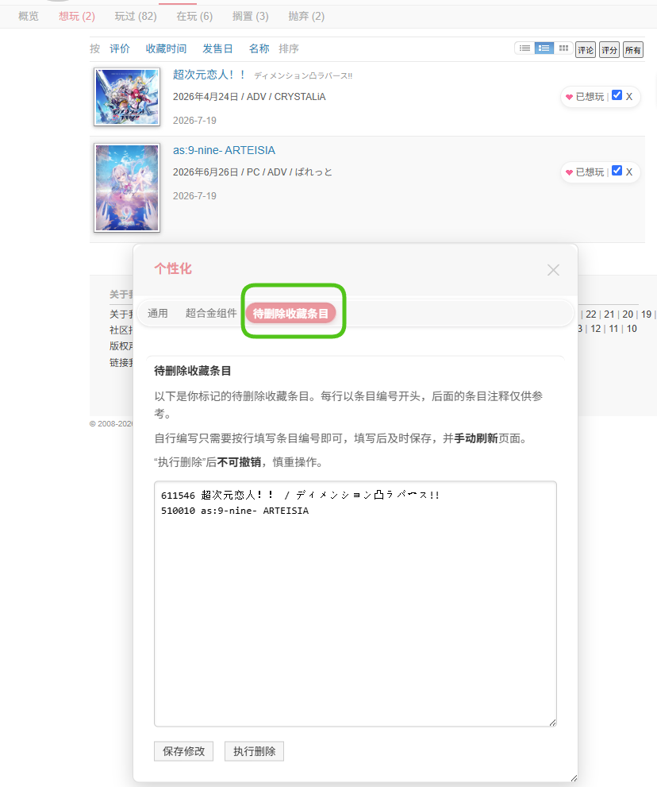

# collect-delete-batch 脚本说明

批量标记收藏条目，自动执行删除操作，免去“删除确认”的弹窗烦恼。
列表页面进行标记，设置页面进行删除前确认，之后浏览器自动批量删除操作，删除期间需要保持浏览器。
每条删除操作预留 5 秒，避免给后台服务器造成不当影响（~~不会更高效的写法~~）。

**删除操作不可撤回，不要用于不当行为，谨慎使用！！！**

## 列表页面

在删除按钮前增加复选框，用于标记待删除的收藏条目（红色方框）；

增加三个快速选择条件（黄色方框），“评论”、“评分”和“所有”，
分别选择或反选本页全部收藏条目、本页没有评论条目（绿色方框）和本页没有打分的收藏条目（橙色方框）；
鼠标放在相应的按钮上，也会有相应的提示。

如果不小心标记错误，可以再次点击复选框取消标记；
所有标记的收藏条目的“删除指令”都将送到[设置页面](#列表页面)进行确认后，开始批量删除。

## 组件设置

适配 Bangumi 的设置界面。

修改删除条目的记录逻辑，现在只需要按行写入想要删除的条目即可。
如果是在收藏列表中添加的，则会自动补充条目的名称和翻译作为参考。

在确认无误后，点击“执行删除”按钮，浏览器将会逐条删除，每条删除时间大约预留 5 秒，
删除时只要不关闭浏览器即可，不妨碍进行其他工作。

新增个性化托盘页面的组件设置，不用跳转页面也可以查看删除列表！

